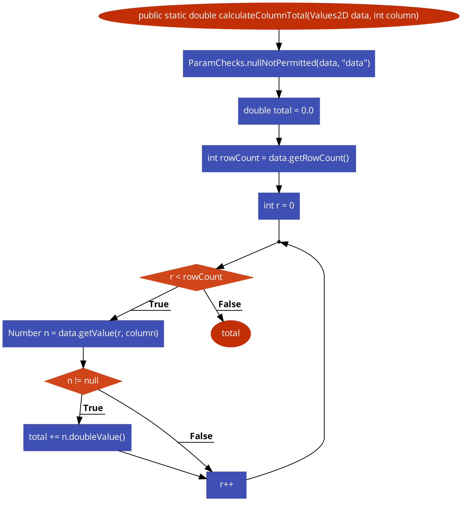
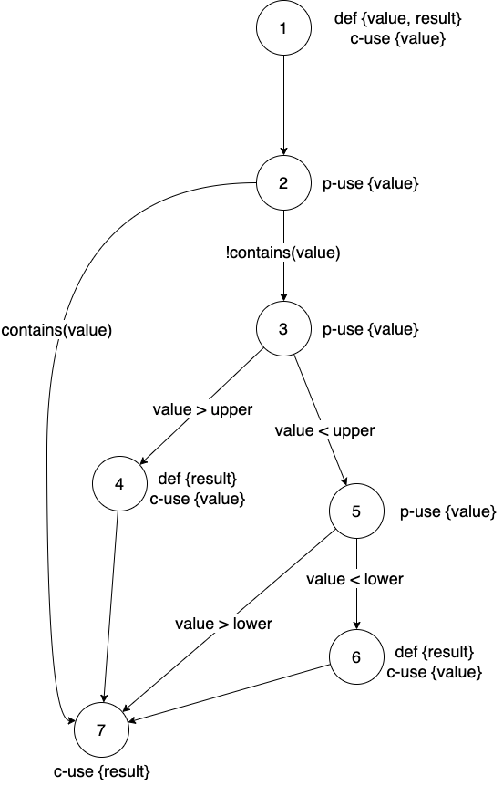
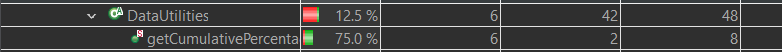
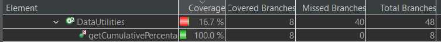
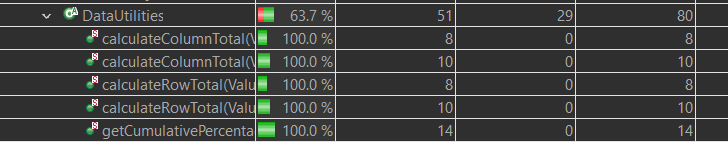
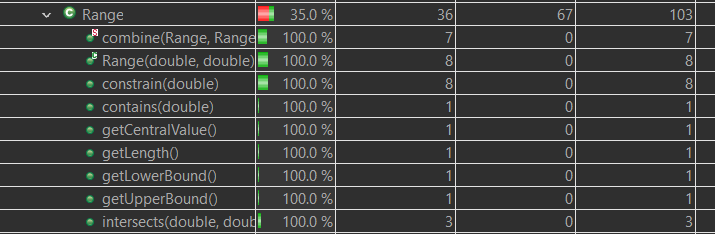
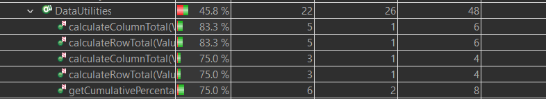
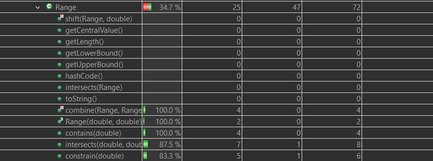
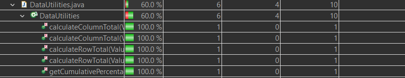
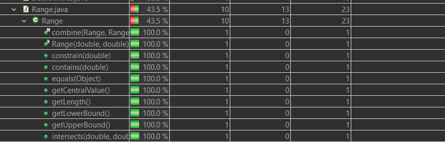

**SENG 438 - Software Testing, Reliability, and Quality**

**Lab. Report #3 – Code Coverage, Adequacy Criteria and Test Case Correlation**

| Group 26         |          |                |
| ---------------- | -------- | -------------- |
| Liana Goodman    | 30089196 | LianaBG        |
| Amir Abdrakmanov | 30085827 | aabdrakmanov   |
| Jared Lundy      | 30086687 | jared840       |
| Jordan Lundy     | 30086686 | jordan427-prog |

### Table of Contents

1. [Introduction](#1-introduction)
2. [Manual Data-Flow Coverage Calculations for `calculateColumnTotal` and `constrain` Methods](#2---manual-data-flow-coverage-calculations-for-calculatecolumntotal-and-constrain-methods)
3. [Testing Strategy for New Unit Tests](#3---testing-strategy-for-new-unit-tests)
4. [Selected Test Cases Using Coverage Information and How They Have Increased Code Coverage](#4---selected-test-cases-using-coverage-information-and-how-they-have-increased-code-coverage)
5. [Coverage Achieved for Each Class and Method](#5---coverage-achieved-for-each-class-and-method)
6. [Pros and Cons of Coverage Tools Used and Metrics Reported](#6---pros-and-cons-of-coverage-tools-used-and-metrics-reported)
7. [Comparing the Advantages and Disadvantages of Requirements-Based Test Generation and Coverage-Based Test Generation](#7---comparing-advantages-and-disadvantages-of-requirements-based-test-generation-and-coverage-based-test-generation)
8. [Teamwork Allocation](#8---teamwork-allocation)
9. [Difficulties, Challenges, and Lessons Learned](#9---difficulties-challenges-and-lessons-learned)
10. [Comments and Feedback](#10---comments-and-feedback)

# 1 - Introduction

This lab explores whitebox testing as well as coverage calculations and tools. Using the same base we used for blackbox testing, we will be able to explore the differences while also practicing JUnit4 and coverage calculations. Throughout the lab, we will also be exploring and comparing some differences between the coverage methods, meeting minimum coverage requirements, and data flow.

# 2 - Manual Data-Flow Coverage Calculations for `calculateColumnTotal` and `constrain` Methods

## calculateColumnTotal

### Data Flow Graph

### Def-Use Table

note: line 123 = 1
| _Variable_ | _Def_ | _Use_ | _DU-Pairs_ |
| --- | --- | --- | --- |
| data | 1 | 2, 4, 6 | (1,2),(1,4),(1,6) |
| column | 1 | 6 | (1,6) |
| total | 3, 8 | 8, 11 | (3,8),(3,11),(8,8),(8,11) |
| rowCount | 4 | 5 | (4,5) |
| r | 5 | 5 ,6 , 9 | (5,5),(5,6),(5,9) |
| n | 6 | 7, 8 | (6,7),(6,8) |

### Def-use sets

| _variable_ | _def set_ | _c-use set_ | _p-use set_ |
| --- | --- | --- | --- |
| data | {1} | {2,4,6} | {} | 
| column | {1} | {6} | {} | 
| total | {3,8} | {8,11} | {} |
| rowCount | {4} | {} | {5} | 
| r | {5} | {6,9} | {5} | 
| n | {6} | {8} | {7} | 

### DU-Pairs per Variable

| _variable_ | _C-Use pairs_ | _P-use pairs_ |
| --- | --- | --- | 
| data | {(1,2),(1,4),(1,6)} | {} |
| column | {(1,6)} | {} |
| total | {(3,8),(3,11),(8,8),(8,11)} | {} |
| rowCount | {} | {(4,5)} |
| r | {(5,6),(5,9)} | {(5,5)} |
| n | {(6,8)} | {(6,7)} |

### pair coverage

| _test case nanme_ | _data pairs tested_ | _column pairs tested_ | _total pairs tested_ | rowCount pairs tested_ | _r pairs tested_ | _n pairs tested_ |
| --- | --- | --- | --- | --- | --- | --- | 
| testValidParameters | (1,2), (1,4), (1,6) | (1,6) | (3,8) (3,11), (8,8), (8,11) | | (5,6), (5,9), (5,5) | (6,8), (6,7) |
| testBoundary | (1,2), (1,4), (1,6) | (1,6) | (3,8) (3,11), (8,8), (8,11) | | (5,6), (5,9), (5,5) | (6,8), (6,7) |
| testOutsideBoundary | (1,2), (1,4), (1,6) | (1,6) | | (4,5) | (5,6) | |
| testNegative | (1,2), (1,4), (1,6) | (1,6) | | (4,5) | (5,6) | |
| testEmpty | (1,2), (1,4), (1,6) | (1,6) | | (4,5) | (5,6) | |
| nullColTest | (1,2) | | | | | | |

### DU-Pair Coverage
Every DU Pair shows up at least once in the test cases for CalculateColumnTotal. Specifically, the testValidParameters test case
hit every DU pair, while the others hit various numbers of pairs. In total, however, every pair was tested at least once, 
indicating a 100% DU paiur coverage for calculateColumnTotal.

## constrain

### Data Flow Graph

### Def-Use Table

| _Variable_ | _Def_ | _Use_   |
| ---------- | ----- | ------- |
| value      | 0     | 1,2,3,5 |
| result     | 1,4,6 | 7       |

### Def Use set per Variable

| _Variable_ | _Def Set_ | _C-Use Set_ | _P-Use Set_ |
| ---------- | --------- | ----------- | ----------- |
| value      | {0}       | {1}         | {2,3,5}     |
| result     | {1,4,6}   | {7}         | {}          |

### DU pairs per Variable

| _Variable_ | _C-Use Pairs_         | _P-Use Pairs_         |
| ---------- | --------------------- | --------------------- |
| value      | {(0,1)}               | {(0,2), (0,3), (0,5)} |
| result     | {(1,7), (4,7), (6,7)} | {}                    |

### Test case pair coverage

| _Test Case_              | _value Pairs_              | _result Pairs_ |
| ------------------------ | -------------------------- | -------------- |
| testRangePositive        | (0,1), (0,2)               | (1,7)          |
| testRangeNegative        | (0,1), (0,2)               | (1,7)          |
| testRangeOutOfRangeAbove | (0,1), (0,2), (0,3)        | (1,7), (4,7)   |
| testRangeOutOfRangeBelow | (0,1), (0,2), (0,3), (0,5) | (1,7), (6,7)   |
| testRangeBoundaryUpper   | (0,1), (0,2)               | (1,7)          |
| testRangeBoundaryLower   | (0,1), (0,2)               | (1,7)          |

### DU Pair Coverage

The dupair coverage for the `constrain` method is 100%, as all pairs appear in the test cases.

# 3 - Testing Strategy for New Unit Tests

## DataUtilities

### clone
> Returns a clone of the specified array.

`clone` specifies that the argument is not permitted to be null and states that the returned value should be a clone of the passed object. Looking at the method code shows that the function copies the contents from one to the other without anything too complicated happenning.

To test this method, we will explore 
- null parameters
- even 2D array with a variety of double entries
- a jagged 2D array with a variety of double entries

### equal
>returns true if two 2D arrays are exactly equal, false otherwise

The following test cases were developed based on the documentation of the `equal` method and its source code.

- two fully equal arrays passed
- two arrays the same length but unequal members
- first array is null, second is fine
- second array is null, first is fine
- both arrays are null
- arrays are of unequal lengths

###createNumberArray

test cased were based on the input variables of a possible incoming data array which consists of doubles. Therefore, the 
corresponding test cases were:

- positive doubles
- negative doubles
- zeros
- null

## Range

### equals
> Tests this object for equality with an arbitrary object.

Based on the provided method description and available code, the following test cases will cover all.
- equivalent Range object
- non-equivalent non-Range object
- non-equivalent Range object (both one for lower and one for upper bounds)
- non-equivalent null object

### combineIgnoringNaN
> Returns a new range that spans both range1 and range2. This method has a special handling to ignore Double.NaN values.

Based on the documentation and visible code, these test cases were appropriate to build:
- null ranges with null return
- 2 cases with each range being null
- Range with Double.NaN value
- Range being Double.NaN
- Both ranges being NaN
- Range without Double.NaN value (individual cases and combined for a total of 3 cases)

### expand
> Creates a new range by adding margins to an existing range.

From the source code and from the documentations, we have built the following test cases:
- no change to lower margin
- no change to upper margin
- negative margins
- null range (not permitted)

### expandToInclude
> Creates a new Range object that includes the passed value

Test cases were created based on the documentation of `expandToInclude` and its source code

- value is inside range
- value is outside lower bound
- value is outside upper bound
- base range is null
- value is NaN
- value is positive infinity
- value is negative infinity

### scale
> Creates a new Range object scaled by a positive factor

Test cases were created based on the documentation of `scale` and its source code

- scale by a positive factor
- scale by a negative factor
- base Range is null
- scale by NaN
- scale by negative infinity
- scale by positive infinity

### shift(Range, double)
> Creates a new Range object shifted by a delta without crossing 0

Test cases were created based on the documentation of `shift(Range, double)` and its source code

- shift by a small positive value
- shift by a large positive value
- shift by a small negative value
- shift by a large negative value
- base Range is null
- shift by negative infinity
- shift by positive infinity 

### isNaNRange

Test cases were created by partitioning the upper bound and lower bound into invalid and valid bounds, 
and then using strong ECT to create a combination of invalid and valid upper bound test cases. 

- both bounds valid
- invalid Lower Bound
- invalid Upper Bound
- invalid both bounds
- null

### toString

Test cases were created by partitioning the Range object that calls the toString method. The partitions were: invalid lower bound with valid upper bound, valid lower bound with invalid upper bound, invalid range and a null range.
Thus, using strong ECT, all 4 cases were tested.
- Invalid lower bound with valid upper bound
- valid lower bound with invalid upper bound
- valid range
- invalid range
- null range

### intersects(Range)

The white box testing for intersects with a range argument was using ECT with removal of any redundant test cases.
The test cases were partitioned based on the states of the incoming range object, namely equal to original, partially overlaps,
overlaps, no overlap; and the boundaries null and invalid. 
- Ranges equal
- Ranges fully overlap one another
- Ranges partially overlap
- Ranges do not overlap
- One range is null
- One range is invalid

### shift(Range, double, boolean)

First, the 3 arguments passed to the method shift were analyzed for equivalence and boundaries. They were evaluated as:
base: {-inf, inf}, {null}
delta: {negative}, {0}, {positive}
allowZeroCrossing: {true}, {false}

Thus, by Strong ECT: 2x3x2 = 12

The twelve test cases were then developed using the equivalence classes and boundaries as such:
- Base= -inf to inf, delta = negative, allowZero= true
- Base = -inf to inf, delta = 0, allowzerocrossing = true
- Base = -inf to inf, delta = positive, allowzerocrossing = true
- Base = -inf to inf, delta = negative, allowZero = false
- Base = -inf to inf, delta = 0, allowzero = flase
- Base = -inf to inf, delta = positive, allowzero = false
- Base = null

NOTE: Got rid of 5 redundant base = null test cases (all throw exceptions)

# 4 - Selected Test Cases Using Coverage Information and How They Have Increased Code Coverage

## 4.1 - DataUtilities `getCumulativePercentages(value)` - testNullData
This test case increased the branch coverage of `getCumulativePercentages` from the DataUtilites class. Originally the branch coverage was 75% as seen below

after adding this test case the branch coverage went up to 100% as seen below

This was done by forcing a a specific branch to be taken in the test case

## 4.2 - Range `equals(Range)` - testNonEquLowerRange
This test case looked at Range class equals method and looked to test the branch where the lower range calue is not equal. This increases the coverage by forcing a specific path and increasing the line coverage. It also hinges on a decision and overall just covers a good blackbox case. Since it covers so many different cases, it helps with everything. Figure 5 shows the branch coverage for Range and anyone with 0 coverage was ignored. Now Figure 1 shows that it the coverage has increased to 100%

## 4.3 -

## 4.4 -

## 4.5 - DataUtilities `equal(double [][], double[][])` 
This test suite was added for the equal method in the Data utilites class. This test suite increased the line, branch and method coverage of the equal method. the coverage increased from 0% to 100% of the method coverage. This was accomplished by analyzing the source code and creating coverages for the method.

# 5 - Coverage Achieved for Each Class and Method

## 5.1 - Blackbox Coverage

The screenshots below are captures of coverage from black box testing and as a result does not show all of the methods in a class.

_Figue 1 - DataUtilities line coverage for blackbox testing_

_Figure 2 - Range line coverage for blackbox testing_

_Figue 3 - DataUtilities branch coverage for blackbox testing_

_Figure 4 - Range branch coverage for blackbox testing_

_Figue 5 - DataUtilities method coverage for blackbox testing_

_Figure 6 - Range method coverage for blackbox testing_

## 5.2 - Whitebox Coverage

The screenshots below show the coverage form white box testing and show the full class coverage.

# 6 - Pros and Cons of Coverage Tools Used and Metrics Reported

The coverage tool ultimately chosen by our team was EclEmma. Due to its ease of access within the eclipse environment and the 
instructions of this lab catered to this coverage tool, it was chosen as our group's tool. However, one drawback of this coverage 
tool is that condition coverage is not tracked by this tool, and thus our group replaced condition coverage with method coverage,
which is tracked by this coverage tool.

# 7 - Comparing Advantages and Disadvantages of Requirements-Based Test Generation and Coverage-Based Test Generation
### Advantages and disadvantages of coverage testing

The main advantage of requirements-based test generation is that it provides a decent method to ensure that a system meets the needed requirements. Thus, requirements based test generation is useful to help confirm that a product is doing something useful, and performing correctly. Additionally, requirements-based gives a general idea of whether or not a system is performing how its supposed to, by comparing expected versus actual outputs. However, requirements-based testing is only as good as its requirements, and thus is dependent on requirements being well defined.
Poorly defined requirements can make generating these test cases difficult. Also, requirements based testing may sometimes miss important parts of the software, especially if the requirement is very complex. 

Coverage testing ensures that a specific amount of code is covered in the testing. This also ensures that the test cases are well distributed and not centered around only a few parts of the code. This type of testing is good to use as an indication to when there is enough or not enough test cases. Many forms of testing can not do so, but coverage testing is a perfect indication os 
fuch. However, this type of testing isn't designed to find all bugs, but rather just ensure code is covered. This means that many bugs can be missed. Also, this type of testing can't ensure the quality of the test cases, only the overall coverage. Also, logical operators aren't understood by this type of testing, and so coverage testing will not be able to deal with them properly. 
Also, coverage testing takes a lot of time to do properly and to meet the coverage percentage. Many test cases might have to be added to ensure coverage is adequate. This would be very time consuming. Coverage testing also helps identify defficiencies in test cases.

# 8 - Teamwork Allocation

Team work divided evenly as follows:

- **Measuring control flow coverage** was done as a full team to familarize ourselves with the system, explore EclEmma and ensure we were all on the same page.
- **Manual coverage calculations** were divided into pair programming to allow groups to work efficiently and on their own schedule (since it is midterm season). Jared and Jordan worked on `calculateColumnTotal` while Amir and Liana worked on `constrain`.
- **Developing new test cases** were divided equally between all members to, once again, allow for schedule flexibility.

Once all work was done, the group came together once again to review eachother's work, build the report, and practice the demo.

# 9 - Difficulties, Challenges, and Lessons Learned
This lab presented few challenges since it built off of the previous lesson. 

We learnt a lot while doing the manual test coverage (including the DU-pairs) and gained a better understanding.

# 10 - Comments and Feedback

It would have been nice for the lab to have reminders or examples on the manual coverage but this did not prove to be overly inconvenient as it was just looked up in the class notes and adapted to the lab.
